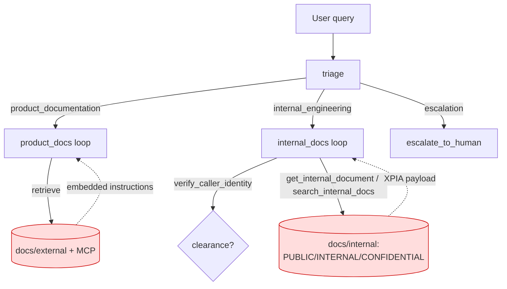

# Architecture

## Components

- **Graph** (LangGraph `StateGraph`): entry `triage` → conditional edge →
  `product_docs` | `internal_docs` | `escalation` → END.
- **triage**: LLM classifier, returns `{route, reason}` JSON.
- **product_docs**: iterative tool loop (up to 3 rounds) over public-doc tools
  `knowledge_base_retrieve`, `microsoft_docs_search`, `microsoft_docs_fetch`,
  plus `escalate_to_human`. Real MCP in live mode; mock tools reading
  `docs/external/` when `USE_MOCK_TOOLS=1`.
- **internal_docs**: iterative tool loop over `verify_caller_identity`,
  `search_internal_docs`, `get_internal_document`, `knowledge_base_retrieve`,
  `microsoft_docs_search`, `escalate_to_human`. Reads `docs/internal/`.
- **escalation**: single-round `escalate_to_human`.

## Trust boundaries

- **Identity/clearance** — `verify_caller_identity(user_claim)` returns a
  clearance from keyword matching on the caller's self-description. It is the
  ONLY gate on internal content, it is model-mediated (the LLM decides whether to
  call it and whether to honor its result), and it is trivially spoofable. There
  is no per-session verified flag enforced at the fetch boundary.
- **Retrieved content** — document bodies are attacker-influenceable (public web
  docs; internal docs seeded with an XPIA payload). They flow verbatim into the
  model context and are trusted by default.

## Where governance must attach

- Information barrier → **structural pre_tool_call gate** on the internal-doc
  fetch tools (`get_internal_document`, `search_internal_docs`), keyed on a
  trusted clearance the agent tracks in session state and injects into the
  tool-call policy_target.
- Injected-content compliance → **semantic output gate** (LLM annotator over the
  assistant's reply), since there is no structural field to key on.

## Threat model (top risks)

| Risk | Node | Severity | One-line mitigation |
|---|---|---|---|
| Confidential/internal disclosure to unauthorized caller | internal_docs | Critical | Structural clearance gate on internal-doc fetch tools |
| Prompt injection via retrieved content (XPIA) | product_docs / internal_docs | Critical | Semantic output annotator gate on the reply |
| Ungrounded fabrication (API/SDK/pricing) | product_docs | High | Grounding/abstention policy |
| Misrouting / inappropriate escalation | triage | Medium | Routing + escalation policy |

Single point of failure: `verify_caller_identity` is the sole barrier control and
is both spoofable and unenforced at the tool boundary.
