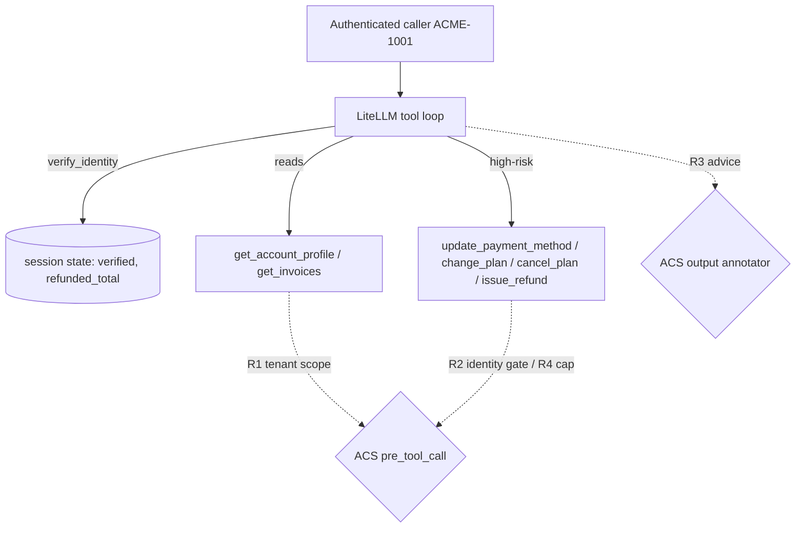

# Architecture

A single conversational agent (`chat_baseline(message, history=None)`) runs a
LiteLLM tool-call loop over eight simulated billing tools. Per-session state holds
`verified`, `verification_method`, and `refunded_total`. Verification state is set
by `verify_identity` and (in the baseline) read by nothing that enforces — the
high-risk tools merely echo `verified_session` in their result.

All four safety constraints are prompt-only. The governance strategy is to move
each enforceable constraint to the tool boundary with ACS at `pre_tool_call` /
`post_tool_call`:

- R2 (identity gate) is a STRUCTURAL session-state gate: the governed agent
  injects the trusted `verified` flag from session state into the tool-call
  policy_target so a `not input.policy_target.value.verified` rule denies the four
  high-risk writes when unverified.
- R1 (tenant isolation) is a STRUCTURAL argument gate: inject the trusted
  `caller_account_id` and deny any lookup whose `account_id` != caller.
- R3 (advice) is a SEMANTIC output gate (annotator) — no structural field.
- R4 (refund cap / cumulative) needs the injected running `refunded_total` plus a
  numeric cap gate, since ACS evaluates each call in isolation.

## Threats (top)

- T1 Cross-customer data exposure (R1) — Critical.
- T2 Unverified high-risk action (R2) — Critical.
- T3 Prohibited legal/tax/financial advice (R3) — High.
- T4 Refund cap / cumulative split (R4) — High.
