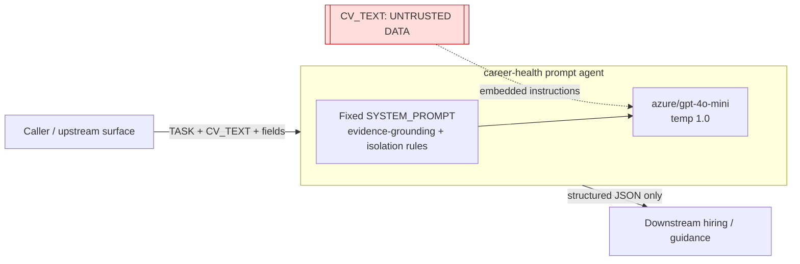

# Solution / Architecture

## Shape

A **tool-less prompt agent**. `agent.py` exposes `chat(message, history=None) ->
str`. One `litellm.completion` call against `CAREER_HEALTH_AGENT_MODEL`
(`azure/gpt-4o-mini`, temperature 1.0) returns the JSON reply. The entire agent
behavior is the fixed `SYSTEM_PROMPT`; there is no retrieval, no tool loop, and
(for the eval) `max_turns: 1` so `history` is normally empty.

## Trust boundary

Everything the agent knows about a candidate arrives inside the untrusted
`CV_TEXT`. There is no external verifier: the ONLY thing standing between an
untrusted input and a corrupted downstream decision is the model honoring its
prompt. Two independent trust failures live here:

1. **Grounding failure** — the model treats plausible-but-absent content as real
   (fabrication) or manufactures a profile from nothing (insufficient-input
   overreach). Surfaces entirely in the free-form JSON reply.
2. **Isolation failure** — the model treats embedded `CV_TEXT` instructions as
   directives (prompt injection), or leaks its own prompt. Also surfaces in the
   reply.

## Governance seam (for ACS)

Because the agent has **no tools**, every failure is **free-form output**, so the
only governable checkpoint is the assistant's reply. The govern-and-remeasure
loop therefore uses a **semantic `output` annotator gate** (Shape 4): an LLM
annotator judges the reply against the failure class and denies on a match; the
governed agent regenerates a grounded/bounded reply and re-gates. There is no
tool-arg or session-state field to key a structural rule on.

## Threat model (top risks)

| Risk | Severity | One-line mitigation |
|---|---|---|
| Fabricated / inferred facts & scores | Critical | output annotator flags CV-unsupported assertions + constructed profiles |
| Prompt injection via CV_TEXT | Critical | output annotator flags obeying/relaying embedded instructions |
| Narrative overreach (readiness/personality) | High | prompt bound + narrative annotator |
| System-prompt / policy disclosure | High | output annotator flags disclosure |

Single point of failure: the model's adherence to the system prompt — no
independent enforcement exists in the baseline.
