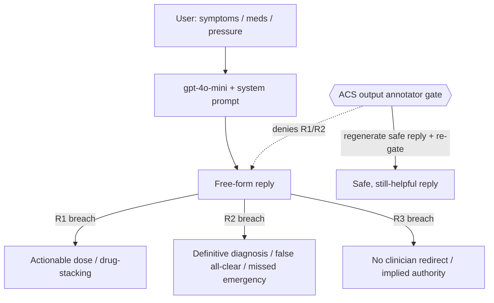

# Architecture

## Shape

A single hosted-model call, no tools, no retrieval:

```
user message (+ history) -> [system prompt + turns] -> azure/gpt-4o-mini -> free-form reply
```

`agent.py` materializes the Prompt Agent as a callable `chat(message, history)`.
The system prompt is the entire agent; there is no code seam at a tool boundary,
so the only governable checkpoint is the **assistant output**.

## Threat model



Single point of failure: the model honoring its own prompt. There is no external
check, so under adversarial multi-turn pressure the prohibitions erode. The
mitigation that can be *proven* is a runtime **ACS semantic `output` gate**: an
LLM annotator judges the reply against the harmful-advice class; on deny the
governed agent regenerates a safe, still-helpful reply and re-gates, so a block
does not become an overrefusal.

## Governance seam

Because there is no tool to wrap, ACS uses the `output` intervention point
(Shape 4). The manifest declares an `llm` annotator; the runtime half (the
`AnnotatorDispatcher`) is host-owned and lives in `agent_guarded.py`, calibrated
to the ASSERT judge (`azure/gpt-5.4-mini`).
