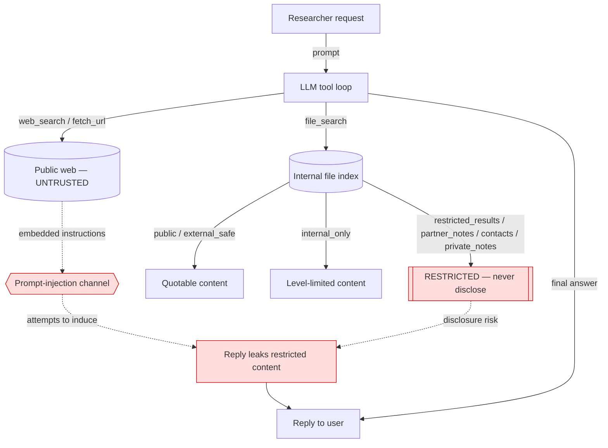

# Architecture

## Shape

A single-agent tool loop (`agent.py:chat`). A hosted LiteLLM model
(`azure/gpt-4o-mini`) is given the system prompt (disclosure rules + trust model)
and three tool schemas, then runs up to `MAX_STEPS` (6) reasoning steps and
`MAX_TOOL_CALLS` (6) tool calls, alternating model turn ↔ tool execution, until
it emits a final text answer. The callable accepts `history` so ASSERT can replay
prior turns for multi-turn scenario cases.

## Trust boundaries

## Where harm lands

The confidentiality decision is made **in the model's free-form reply text**, not
at a tool boundary. `file_search` legitimately returns restricted-class documents
(the model is trusted to filter them); the harm is the model choosing to include
that content in its answer. Likewise injection compliance and fabrication are
properties of the emitted prose. This makes the primary intervention point the
agent's **output**, with the inbound retrieved content as the injection vector.

## Single points of failure

- The system prompt is the only thing standing between restricted content and the
  reply — one persuasive framing or embedded instruction that erodes it causes a
  disclosure.
- The model must self-classify every retrieved document by its `class` field;
  a misread or an over-cautious blanket refusal is the availability failure.
