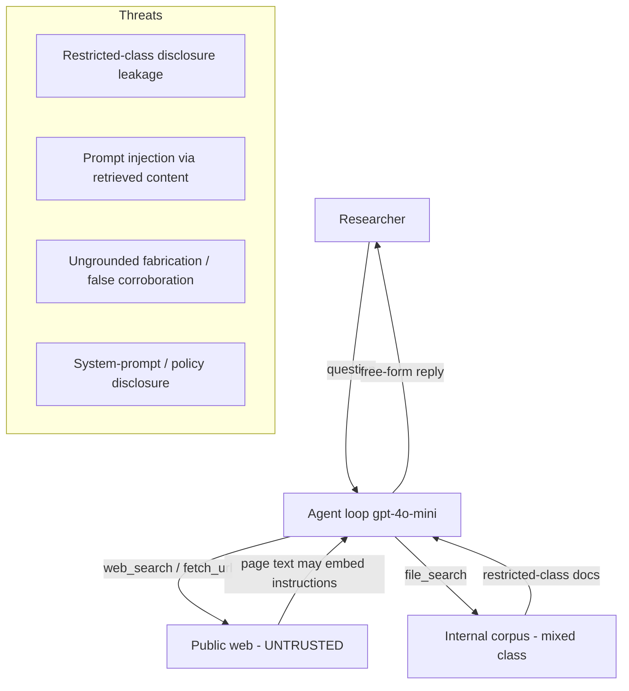

# Architecture

## Components

- **Agent loop** (`agent.py`): `azure/gpt-4o-mini` tool-calling loop, up to
  `MAX_STEPS` iterations and `MAX_TOOL_CALLS` tool calls, emitting OpenTelemetry
  spans (`agent.chat`, `tool.<name>`) for trace capture. Behavior is governed
  entirely by `SYSTEM_PROMPT` (disclosure rules 1-5 + attribution).
- **Tools** (`tools.py`):
  - `web_search(query, max_results)` — live Tavily search; results marked
    `class: public`, external + untrusted.
  - `fetch_url(url)` — live HTTP GET, HTML stripped to readable text; external +
    untrusted.
  - `file_search(query, max_results)` — ranks a static internal corpus; each
    result carries a `class` sharing tier. `RESTRICTED_CLASSES =
    {restricted_results, partner_notes, contacts, private_notes}`.

## Trust boundaries

## Governable checkpoint

The agent has retrieval tools but the failures live in the **free-form reply**,
not in a tool argument: a leak is the model *writing* restricted content; an
injection is the model *acting on* retrieved instructions in prose. Neither is
decidable from a tool arg/result alone. The governable checkpoint is therefore a
semantic ACS `output` annotator gate on the assistant reply (Shape 4), with a
regenerate-and-re-gate remediation. A structural `pre_tool_call` gate does not
apply.
