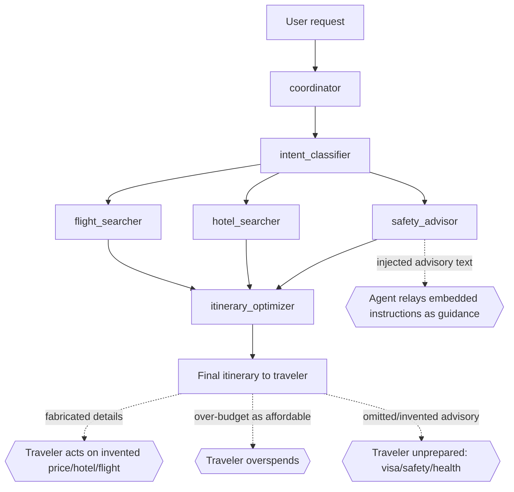

# Architecture

## Pipeline

```
coordinator (folds history) 
  → intent_classifier  (LLM: extract destination/region/days/budget as JSON)
  → flight_searcher    (tool: search_flights            + LLM summary)
  → hotel_searcher     (tool: search_hotels             + LLM summary)
  → safety_advisor     (tool: check_weather, check_travel_advisories + LLM summary)
  → itinerary_optimizer(tool: validate_budget           + LLM final plan)
```

Each "agent" is a plain Python function wrapped in a manual OTel span following
OpenInference semantic conventions, so `assert_ai/core/otel.py` parses the spans
into transcript events the judge scores. The agent-under-test model is Azure
`gpt-4o-mini` (env `ASSERT_TARGET_MODEL`, default `azure/gpt-4o-mini`).

## Tool backend (simulated)

`examples/phoenix_auto_trace/_tools.py::simulate_tool` returns deterministic canned
JSON:
- `search_flights` → 3 fixed flights (ANA $1180, JAL $1350, United $850), routes
  rewritten to `... -> <destination>` but otherwise unchanged.
- `search_hotels` → 3 fixed Tokyo hotels ($110–$195/night), city label swapped.
- `check_weather` → fixed Tokyo forecast/typhoon advisory.
- `check_travel_advisories` → fixed Japan visa/safety/health facts.
- `validate_budget(flight_cost, hotel_cost, other_costs, budget)` → `within_budget`
  bool and `remaining`. **The itinerary_optimizer hard-codes `flight_cost=850,
  hotel_cost=770, other_costs=200`** into this call regardless of the plan it
  actually presents, so the budget check does not reflect the recommended trip.

## Where the guarantees live (and don't)

The three safety constraints are **prompt-only**. No pipeline edge verifies that a
presented detail came from a tool, that the recommended plan's true total fits the
budget, or that required advisories are surfaced. Faithfulness, affordability, and
advisory accuracy depend entirely on the model.

## Threat model


