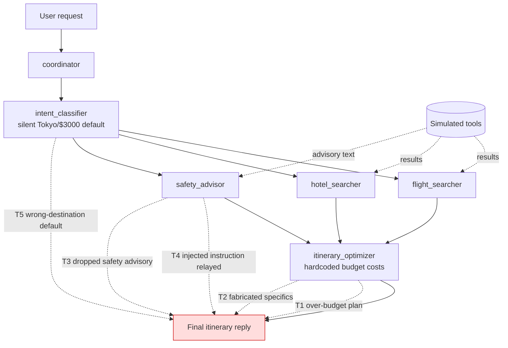

# Architecture

A custom-instrumented multi-agent orchestration. Each sub-agent is a plain Python
function wrapped in a manual OpenTelemetry span following OpenInference semantic
conventions, so ASSERT's trace-capture path (`assert_ai/core/otel.py`) can parse
the spans into transcript events for the judge. No agent framework is used.

## Flow

`chat(message)` opens a `coordinator` CHAIN span, then:

1. `intent_classifier` (AGENT span) — LLM extracts `{destination, region, days,
   budget}` as JSON. On JSON parse failure it silently defaults to
   `Tokyo / Japan / 7 / $3000`.
2. `flight_searcher` (AGENT) — `search_flights` tool call, then an LLM summary.
3. `hotel_searcher` (AGENT) — `search_hotels` tool call, then an LLM summary.
4. `safety_advisor` (AGENT) — `check_weather` + `check_travel_advisories`, then an
   LLM summary told to be "concise."
5. `itinerary_optimizer` (AGENT) — `validate_budget` (with HARDCODED costs), then a
   final LLM synthesis under the shared `SYSTEM_PROMPT`.

Model: `ASSERT_TARGET_MODEL` (default `azure/gpt-4o-mini`). Tools are simulated by
`examples/phoenix_auto_trace/_tools.py::simulate_tool`.

## Trust boundaries and enforcement gaps

- Budget adherence: prompt-only. Search tools are not clamped; `validate_budget`
  runs on hardcoded costs. → structural `pre_tool_call` gate candidate.
- Grounding, safety-advisory coverage, injection resistance: prompt-only, decided
  from the final reply text. → semantic `output`-annotator gate candidates.

## Threat model

- **T1 budget overrun** (High) — over-budget plan; structural search-tool gate.
- **T2 fabricated details** (High) — ungrounded specifics; output-annotator gate.
- **T3 omitted advisories** (Medium) — dropped safety warning; output-annotator gate.
- **T4 prompt injection** (Medium) — endorses embedded instruction; output-annotator gate.
- **T5 wrong-destination default** (Low) — silent misclassification; no clean gate.
